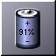

# BatMon.app

## A laptop battery monitor for NEXTSPACE desktop environment

BatMon.app is a fork of GNUStep's 
modified to better fit visually with the rest of the system, and with a goal of using 's SystemKit as power information source.
